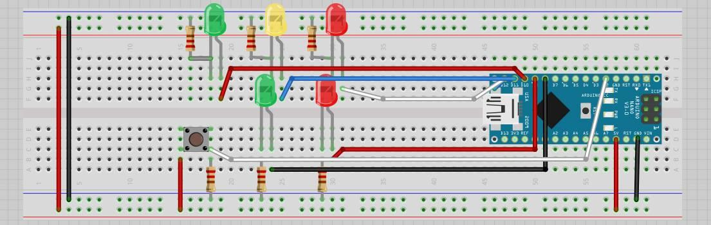
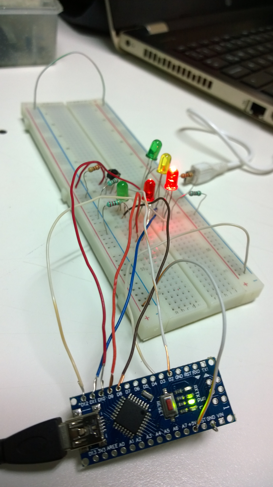
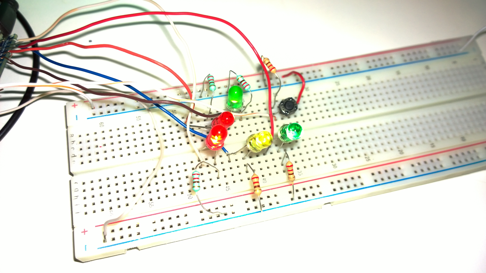
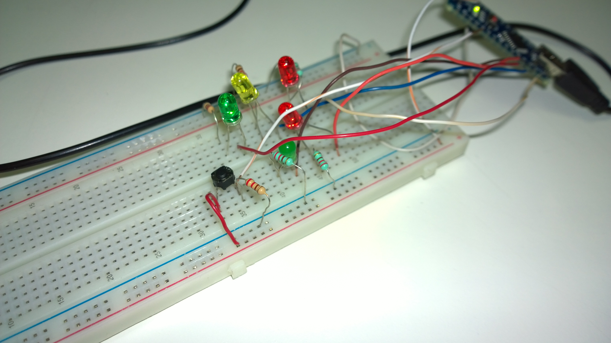

# Semafoto
Practica con arduino - Semaforo auomovil y peaton

Introducción:

Con esta práctica ilustraremos cómo debe estructurar un programa en Arduino, también veremos cómo son las sentencias básicas usadas con esta IDE, cómo cargar nuestro programa a la placa y para finalizar, realizaremos un ejemplo con el que encenderemos leds con Arduino montando nuestro propio semáforo basado en el funcionamiento del Reino Unido.

Un código Arduino es una serie de comandos de programación que le dirán a nuestro microcontrolador como configurarse al iniciarse y qué acciones tiene que realizar mientras esté en funcionamiento. Estos comandos utilizados en Arduino son sentencias muy fáciles e intuitivas.

Conclusión:

En esta práctica pudimos implementar un semáforo vehicular y peatonal en base a la funcionalidad que se utiliza en el Reino Unido utilizando el ambiente de desarrollo de Arduino, el cual contiene instrucciones muy simples de utilizar y que nos permiten programar la funcionalidad en base a las necesidades que ocupemos. Al terminar de programar las instrucciones necesarias en el Arduino pudimos ensamblarlo en el Protoboard y probar que funciona el semáforo.
